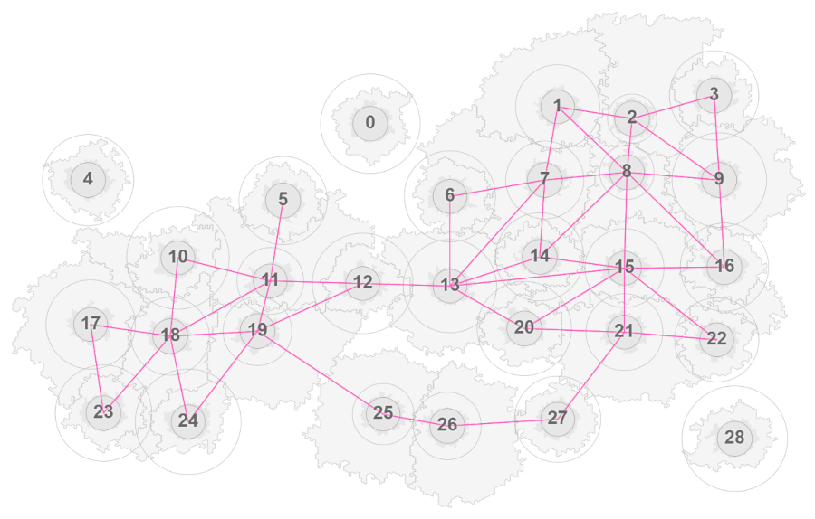

# kiwotigo

 [](https://goreportcard.com/report/github.com/spearwolf/kiwotigo)

_kiwotigo_ is world map generation tool.

the world builder algorithm generates randomly generated 2D maps, on which _regions_ are distributed, with the following characteristics:

- each region has a base area that has a minimum size (can be configured)
- each region has at least one or more _connections_ to another nearby region
- each region is accessible from any region via these connections

A group of regions that are close together form a _continent_, there may (but need not) be several continents, and a continent can also consist of only one region (like islands).

Although the generation of regions is essentially based on randomness, it can be configured quite extensively.

As output, the world builder provides a json structure, the _intermediate continental format_.
See [ICF.md](./ICF.md) for a full technical specification.

_kiwotigo_ is written in javascript, whereas the core of the world map builder is developed in [go](https://golang.org/) and integrated via [webassembly](https://webassembly.org/).



&rarr; [Just try it out for yourself!](https://spearwolf.github.io/kiwotigo/)

## Why?

_kiwotigo_ creates worlds, but doesn't tell you what to do with them.
that's up to you. you're a indie-gamedev and need a tool to create 2D or maybe 3D maps? or you just want to create a nice graphics demo and need random input? go ahead, let your inspiration run wild - and don't forget to drop me a message (or a PR) if you want to show something off :wink:

## Getting Started

As a precondition a current nodejs v22.13+ with pnpm v10.9 and a go-lang (1.24+) sdk has to be installed.

Build the _kiwotigo_ library with:

```sh
$ pnpm build
```

### Demo Web Server

Start a local http server to explore the interactive demo UI in your browser:

```sh
$ pnpm dev
```

### Node.js CLI

Alternatively, you can generate world maps directly from the command line using the `kiwotigo-cli.mjs` Node.js script. It runs the full pipeline (WASM continent generation, ICF conversion, path smoothing, island detection & connection) and outputs the final ICF as JSON.

```sh
# Generate a world map with default settings, output JSON to stdout
$ node kiwotigo-cli.mjs

# Pretty-print the output
$ node kiwotigo-cli.mjs --prettyPrint

# Write output to a file
$ node kiwotigo-cli.mjs -o world.json

# Use a config file
$ node kiwotigo-cli.mjs -c config.json -o world.json

# Override individual config values (these take precedence over the config file)
$ node kiwotigo-cli.mjs --gridWidth=10 --gridHeight=10 --prettyPrint

# Combine a config file with overrides and file output
$ node kiwotigo-cli.mjs -c config.json --gridWidth=12 -o world.json

# Re-use a previously generated ICF file as config input (extracts the "config" property)
$ node kiwotigo-cli.mjs -c world.json -o new-world.json

# Show all available options
$ node kiwotigo-cli.mjs --help
```

Progress information is written to stderr, so piping works as expected:

```sh
$ node kiwotigo-cli.mjs --gridWidth=8 --gridHeight=8 > world.json
```

have fun!


## LICENSE

the kiwotigo code is licensed under the GPLv3. see [LICENSE](./LICENSE.txt) for details.
