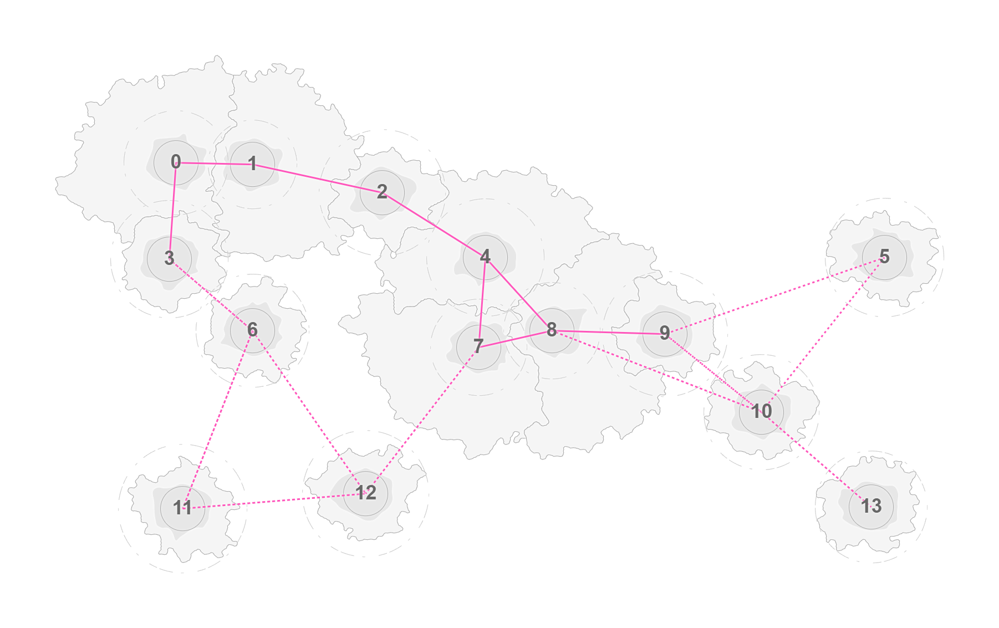

# kiwotigo

 [](https://goreportcard.com/report/github.com/spearwolf/kiwotigo)

_kiwotigo_ is world map generation tool.

the world builder algorithm generates randomly generated 2D maps, on which _regions_ are distributed, with the following characteristics:

- each region has a base area that has a minimum size (can be configured)
- each region has at least one or more _connections_ to another nearby region
- each region is accessible from any region via these connections

A group of regions that are close together form a _continent_, there may (but need not) be several continents, and a continent can also consist of only one region (like islands).

Although the generation of regions is essentially based on randomness, it can be configured quite extensively.

As output, the world builder provides a json structure, the _intermediate continental format_.

_kiwotigo_ is written in javascript, whereas the core of the world map builder is developed in [go](https://golang.org/) and integrated via [webassembly](https://webassembly.org/).



&rarr; [Just try it out for yourself!](https://spearwolf.github.io/kiwotigo/)

## Why?

_kiwotigo_ creates worlds, but doesn't tell you what to do with them.
that's up to you. you're a indie-gamedev and need a tool to create 2D or maybe 3D maps? or you just want to create a nice graphics demo and need random input? go ahead, let your inspiration run wild - and don't forget to drop me a message (or a PR) if you want to show something off :wink:

## Local Development

As a precondition a current nodejs v16+ and a go-lang (1.17+) sdk has to be installed.

Build the _kiwotigo_ library with:

```sh
$ npm run build  # -> npx gulp buildAll
```

Start a http server for testing the kiwotigo.wasm module with:

```sh
$ npx serve
```

as an alternative you can use the gulp tasks:

```sh
$ npx gulp --tasks  # show all tasks
```

or just start developing with:

```sh
$ npm start
```

have fun!


## LICENSE

the kiwotigo code is licensed under the GPLv3. see [LICENSE](./LICENSE.txt) for details.
